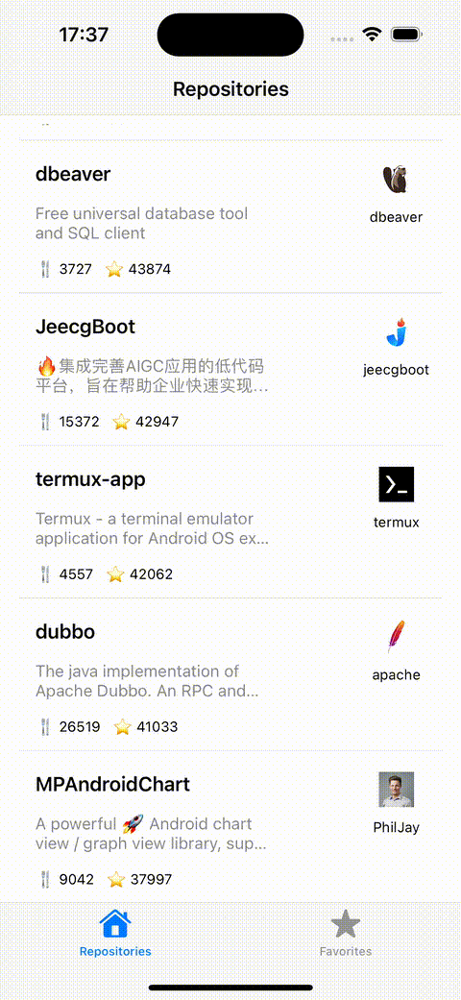

# Java Repositories

Projeto iOS desenvolvido em **Swift** com **UIKit**, aplicando a arquitetura **MVVM**, utilizando **Combine**, **URLSession**, **Async/Await** e com foco em **Acessibilidade**.  
Ele lista os repositórios Java mais populares do GitHub, com uma interface fluida, responsiva e inclusiva.

---

##  Funcionalidades

- Listagem dos repositórios mais populares escritos em Java
- Requisições assíncronas com `URLSession` + `async/await`
- Atualização reativa da UI com `Combine`
- Arquitetura limpa baseada em `MVVM`
- Suporte à acessibilidade com `VoiceOver`
- Persistência local com `UserDefaults`
- Testes unitários com `XCTest`

---

## 🛠️ Tecnologias

- Swift 5
- UIKit
- MVVM
- Combine
- URLSession + async/await
- Accessibility APIs
- XCTest

---

## Exemplo de chamadas na API:
```bash
https://api.github.com/repos/<criador>/<repositório>/pulls
```
```bash
https://api.github.com/search/repositories?q=language:Java&sort=stars&
page=1
```

---

## Exemplo utilizado com Voice Over


---

## Exemplo do projeto



---

## 🚀 Como rodar o projeto

1. Clone o repositório:
   ```bash
   git clone https://github.com/seu-usuario/nome-do-repositorio.git

2. Abra o projeto no xcode:
  ```bash
  GitHubJavaRepositories > Java Repositories > Java Repositories.xcodeproj
